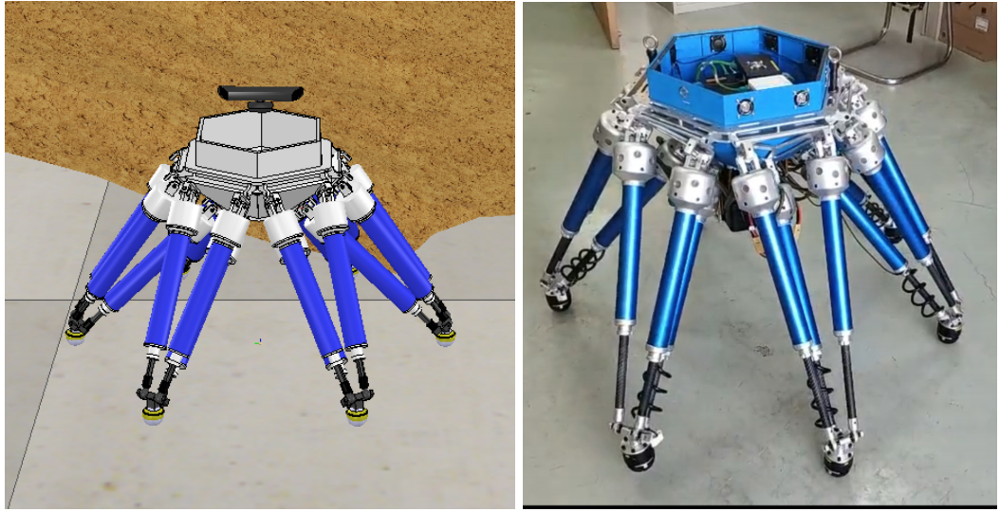
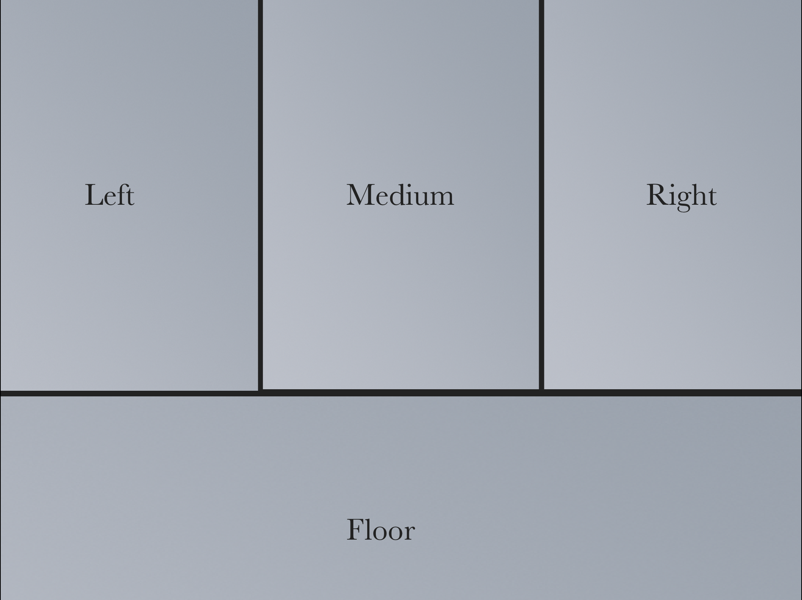
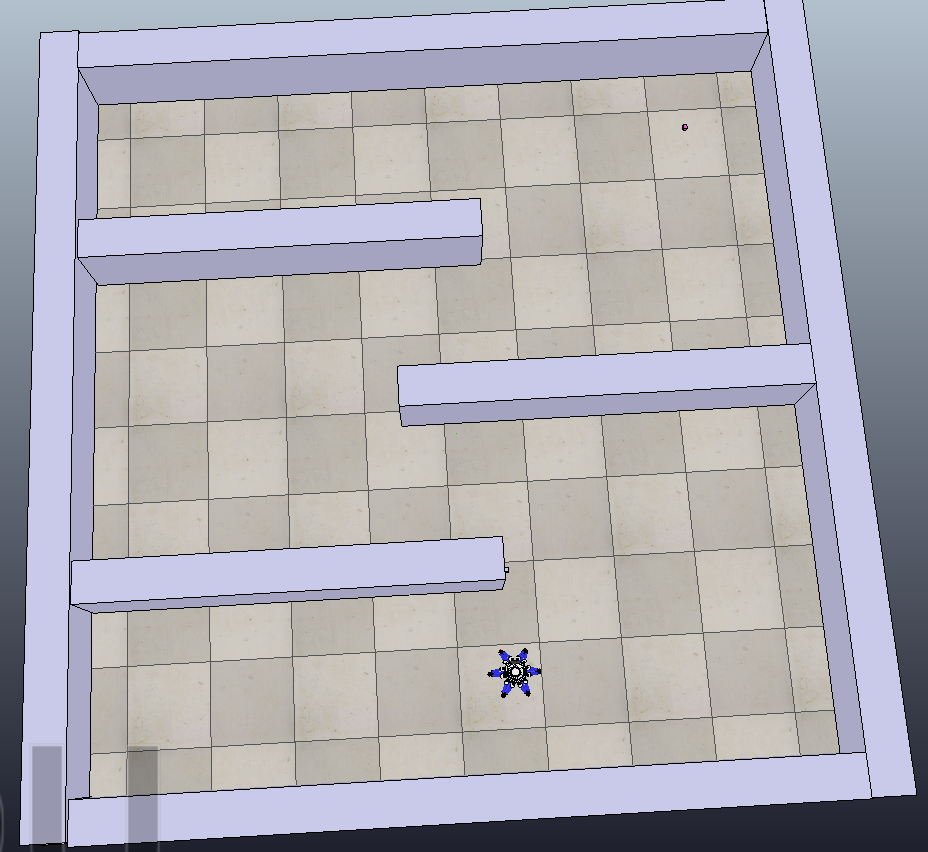
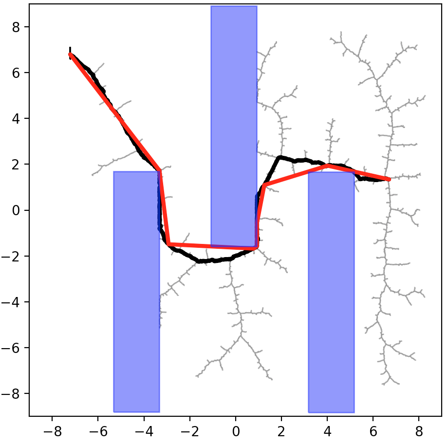

# VrepMotionPlanning
> Environment：VREP3.5  & Python 3.5 

This is a project based on VREP platform using RRT & A* to do motion and path planning on a six-legged robot shown as follow.



### 1.A* Path Planning

Firstly we use A* to do path planning while not knowing the environment. We cut the spaces into pieces like the follow graph, simply using the information given by depth kinect camera and just do A* on the six-legged robot. The video Astar.mp4 shows the result. To run A* code please cd into the Astar folder and start your VREP using the ttt file inside Astar. The two algorithms are both implemented in the puzzle as follow.

```
python sixlegged_5.py
```





### 2.RRT Path Planning

After the implementation of A* not having the knowledge of the environment, we use RRT for a fully observed environment. This time we know where is the goal and where is the obstacles. Then we can compute the path using RRT algorithm and get the following result. The RRT.mp4 shows the dummy type RRT result in VREP. To run the robotic RRT, cd into the RRT folder and use the ttt file inside the folder.

```
python sixlegged_RRT.py
```



### Problem & To be improved

The robot will crash into pieces during a certain period of time. We haven't fixed it successfully yet. Thus you may not see the robot succeed its way to the goal point, but on the half way it explode. The next things we will do is to fix the problem and try to implement difficult motion planning task on it.